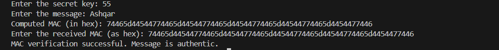

# EX-NO-13-MESSAGE-AUTHENTICATION-CODE-MAC

## AIM:
To implement MESSAGE AUTHENTICATION CODE(MAC)

## ALGORITHM:

1. Message Authentication Code (MAC) is a cryptographic technique used to verify the integrity and authenticity of a message by using a secret key.

2. Initialization:
   - Choose a cryptographic hash function \( H \) (e.g., SHA-256) and a secret key \( K \).
   - The message \( M \) to be authenticated is input along with the secret key \( K \).

3. MAC Generation:
   - Compute the MAC by applying the hash function to the combination of the message \( M \) and the secret key \( K \): 
     \[
     \text{MAC}(M, K) = H(K || M)
     \]
     where \( || \) denotes concatenation of \( K \) and \( M \).

4. Verification:
   - The recipient, who knows the secret key \( K \), computes the MAC using the received message \( M \) and the same hash function.
   - The recipient compares the computed MAC with the received MAC. If they match, the message is authentic and unchanged.

5. Security: The security of the MAC relies on the secret key \( K \) and the strength of the hash function \( H \), ensuring that an attacker cannot forge a valid MAC without knowledge of the key.

## Program:
```
#include <stdio.h>
#include <string.h>

#define MAC_SIZE 32

// Compute MAC using XOR
void computeMAC(const char *key, const char *message, unsigned char *mac) {
    int key_len = strlen(key);
    int msg_len = strlen(message);

    for (int i = 0; i < MAC_SIZE; i++) {
        unsigned char k = (unsigned char) key[i % key_len];
        unsigned char m = (unsigned char) message[i % msg_len];
        mac[i] = k ^ m;
    }
}

int main() {
    char key[100], message[100];
    unsigned char mac[MAC_SIZE];
    unsigned char receivedMAC[MAC_SIZE];

    printf("Enter the secret key: ");
    scanf("%99s", key);

    printf("Enter the message: ");
    scanf("%99s", message);

    computeMAC(key, message, mac);

    printf("Computed MAC (in hex): ");
    for (int i = 0; i < MAC_SIZE; i++) {
        printf("%02x", mac[i]);
    }
    printf("\n");

    // Read hex string
    printf("Enter the received MAC (as hex): ");
    char hexInput[2 * MAC_SIZE + 1];
    scanf("%64s", hexInput);

    // Convert hex string → bytes
    for (int i = 0; i < MAC_SIZE; i++) {
        unsigned int byte;
        sscanf(&hexInput[i * 2], "%2x", &byte);
        receivedMAC[i] = (unsigned char)byte;
    }


    // Final verification
    if (memcmp(mac, receivedMAC, MAC_SIZE) == 0) {
        printf("MAC verification successful. Message is authentic.\n");
    } else {
        printf("MAC verification failed. Message is not authentic.\n");
    }

    return 0;
}
```

## Output:



## Result:
The program is executed successfully.
